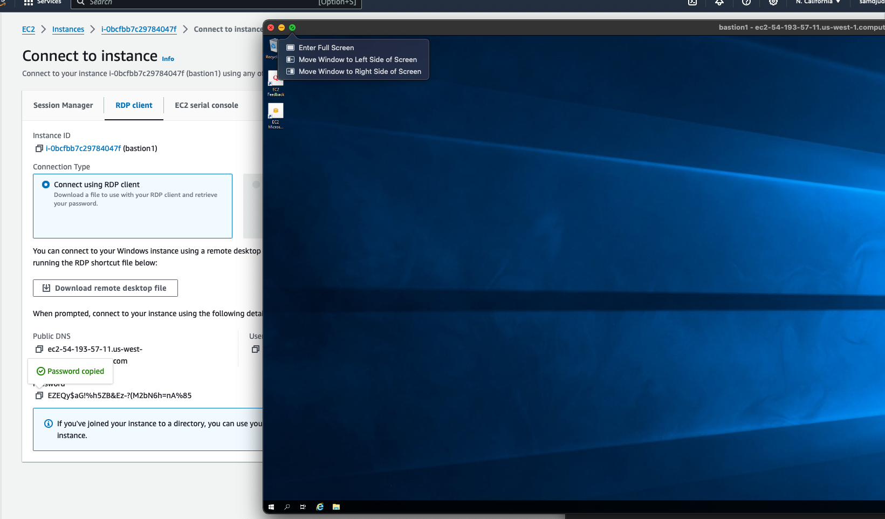
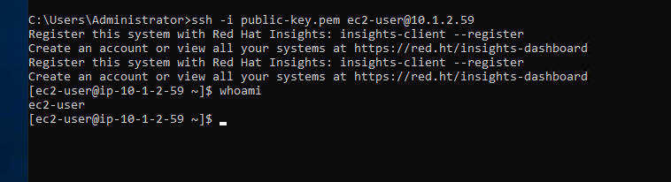

# Coalfire Technical Challenge

### **Question 1:**

1. Here are the steps that I would take to thoroughly investigate the issue:
    
    **Check Network Security Groups:**
    
    I would ensure that the security groups associated with the instances and the load balancer allow the necessary inbound and outbound traffic. Confirm that the load balancers's security group is configured to allow traffic on port 443. Included in this is checking the DNS configuration in Route53.
    
    **Examine Subnet Route Tables:**
    
    I would confirm that the route tables associated with the subnets are configured correctly.
    
    **Review Load Balancer Configuration:**
    
    I would check the ALB configuration. I would ensure that the load balancer is correctly forwarding traffic to the appropriate destination.
    
    Check **Instance Health:**
    
    I would verify that the health of the compute instances are good, especially the web server instances in WP Subnet 1. I would also check all of the logs for all of the instances to try and discover any leads.
    

I would feel confident that I could find the issue with these steps.

1. The key metrics that I would expect would be the following:
    - CloudWatch (EC2 CPU usage, network throughput, disk I/O, etc)
    - ALB (Request counts, latency, etc)
    - Logging (web server logs, database logs, application logs, etc)

1. Here are the things that I would implement to reduce the risk of a repeat incident:
    - Implement IaC - Introducing Terraform (or similar tool) enables version control, consistency and ability to recreate environments quickly and safely.
    - Increase Redundancy - I would deploy across an additional region to increase fault tolerance.
    - Enable VPC Flow Logs - This will enable us to capture IP traffic to and from our network. We can use that information to diagnose connectivity issues.
    - Enable Auto-scaling for Web Servers - this will help mitigate any outages caused by increased network traffic.

### **Post-Mortem:**

**High-Level Summary:**

On Friday, at 4:35 PM, users reported an inability to access the web application. The incident resulted in a period of downtime, impacting the availability of the application. The incident response team worked to identify and resolve the issue promptly.

**Stakeholders Involved:**

A representative in the following capacities:

- Sys Admin
- DevOps Engineer/SRE
- Front End + Back End Engineers (engineers who work on both the web application and the web servers)
- Security Engineer/Analyst
- Project Manager (liaison with management/potential client)

**Timeline:**

**4:35 PM: Incident Detection:**

- Users report an inability to access the web application.
- “Web_Application_Alive” test failed.

**4:40 PM: Incident Response Initiated:**

- The operations team is alerted through monitoring systems and initiates the incident response process.

**4:45 PM: Initial Investigation:**

- Teams investigate logs, CloudWatch metrics, and alerts to identify the scope and potential root cause of the incident.

**5:00 PM: Bastion Host Connectivity Issue Identified:**

- Operations team identifies connectivity issues with the bastion host in Public Subnet 1.

**5:15 PM: Bastion Host Recovery:**

- Bastion host connectivity is restored by reconfiguring the security group rules. The team confirms the restoration of access.

**5:30 PM: Web Application Server Recovery:**

- Operations team identifies issues with one of the web server instances in WP Subnet 1. Auto Scaling groups are adjusted, and the instance is replaced.

**6:00 PM: Web Application Up and Running:**

- The web application is fully functional again, and users regain access.

**6:30 PM: Post-Mortem Meeting:**

- A cross-functional team meeting is held to discuss the incident, share findings, and plan preventative measures.

**7:00 PM: Stakeholder Communication:**

- A communication plan is executed to inform stakeholders, customers (if needed), about the incident, its resolution, and steps taken to prevent repeat incidents.

**Root Cause Analysis:**

The root cause of the incident was identified as a misconfiguration in the security group rules associated with the bastion host in Public Subnet 1.

The Five Why’s:

1. The security group rules were misconfigured.
2. Changes to the bastion host weren’t properly tested/reviewed.
3. There is a lack of documentation/process surrounding configuration of the web-servers/bastion servers.
4. We don’t utilize IaC to automate security group updates and the addition of version control.
5. There aren’t regular architecture audits to identify and plan system improvements.

Action Items:

- Implement IaC.
- Create documentation around the process of configuration the web-application (code approvals, testing, etc)
- Train relevant engineers on the new process.
- Schedule regular architecture audits to discuss necessary improvements to the system.

### Question:

Documentation can be found in the README of the `q2` directory along with the codified solutions.

## Terraform Submission Notes:

- RDS, Route53 and CloudWatch were omitted from my Terraform given that there was no real web app to host.
- I hard coded a key-pair to connect to my ec2 instances via ssh
- I created a manual security group that allowed ssh and rdp from my IP address (and the bastion host) manually.
- I decided to use Terraform modules to accomplish this task and separated all of the components by function (alb, ec2, rds, subnets, vpc). Doing this makes my system scalable and easy to read.

Here is the first time connecting to the windows server via RDP.

I was able to connect to the WP Subnet 2 from Public Subnet 1

### Helpful Sources:

- https://github.com/dyordsabuzo/understanding-reverse-proxy/blob/d7958029cf45af232dddc121a84977327eb108f3/lb/main.tf
- https://developer.hashicorp.com/terraform/tutorials/modules/module#module-best-practices
- This specific comment on this forum helped me realize that one of my subnets was in the wrong availability region: https://serverfault.com/a/705021
- ChatGPT - I love using AI language models to help debug error codes and generate boilerplate code.
-
